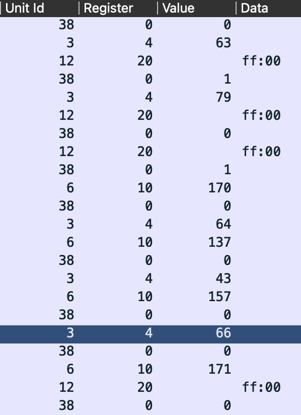

throwing the pcap in wireshark shows some modbus/tcp communications

open in wireshark, filter out with `(_ws.col.protocol == "Modbus/TCP") && !(modbus.request_frame)`

let's add a few interesting columns

we can start to see patterns

we can see only some registers are written to, but there is a strange one, registry 0 is using a 16 bits registry to store only a binary value.

let's filter on that with `((_ws.col.protocol == "Modbus/TCP") && !(modbus.request_frame)) && (modbus.regnum16 == 0)`

if we copy paste, trim and string up all the binary-like values together, we end up with a very [interesting file](https://cyberchef.formality.de/#recipe=From_Binary('Space',8)&input=MCAxIDAgMSAwIDAgMCAwIDAgMSAwIDAgMSAwIDEgMSAwIDAgMCAwIDAgMCAxIDEgMCAwIDAgMCAwIDEgMCAwIDAgMCAwIDAgMSAwIDEgMCAwIDAgMCAwIDAgMCAwIDAgMCAwIDAgMCAxIDAgMCAxIDAgMCAwIDAgMCAwIDAgMCAwIDAgMCAwIDAgMCAwIDAgMCAwIDAgMCAwIDAgMCAwIDEgMCAwIDAgMSAwIDEgMSAwIDEgMCAxIDAgMSAxIDAgMCAwIDEgMSAxIDAgMSAwIDAgMSAwIDEgMSAwIDEgMSAxIDAgMSAwIDEgMSAxIDEgMCAxIDAgMSAwIDEgMCAwIDAgMSAxIDAgMSAwIDAgMCAxIDAgMSAxIDAgMSAwIDEgMCAwIDEgMSAwIDAgMSAxIDAgMCAwIDAgMCAwIDAgMCAwIDAgMCAwIDAgMCAwIDAgMCAwIDAgMCAwIDAgMCAwIDAgMCAxIDAgMCAxIDEgMSAwIDAgMCAwIDAgMCAwIDAgMCAwIDAgMCAwIDAgMCAwIDAgMCAwIDAgMCAwIDAgMCAwIDAgMCAwIDEgMCAwIDAgMCAwIDAgMCAwIDAgMCAwIDAgMCAwIDEgMSAxIDAgMCAwIDAgMCAwIDAgMCAwIDAgMCAxIDEgMCAwIDEgMSAwIDAgMSAxIDAgMSAxIDAgMCAwIDEgMSAwIDAgMCAwIDEgMCAxIDEgMCAwIDEgMSAxIDAgMCAxIDAgMSAxIDEgMCAwIDEgMSAxIDAgMSAwIDAgMCAxIDEgMSAxIDAgMCAwIDAgMSAxIDEgMCAxIDAgMCAwIDEgMCAxIDAgMSAwIDEgMCAxIDAgMSAwIDEgMCAwIDAgMCAwIDAgMSAwIDAgMSAwIDAgMCAwIDAgMCAwIDAgMCAwIDAgMCAwIDAgMSAxIDEgMCAxIDAgMCAxIDAgMSAxIDAgMSAwIDEgMCAwIDAgMSAxIDAgMSAwIDEgMSAwIDAgMSAxIDAgMSAwIDAgMCAxIDEgMSAwIDAgMSAxIDAgMSAwIDEgMCAxIDAgMCAwIDEgMSAwIDEgMCAxIDEgMCAwIDEgMSAwIDEgMCAwIDAgMCAxIDEgMSAwIDEgMCAxIDAgMSAxIDEgMSAwIDAgMCAwIDAgMCAwIDEgMCAxIDEgMCAwIDAgMCAwIDAgMCAwIDAgMCAwIDAgMCAwIDAgMSAwIDAgMCAwIDAgMSAwIDAgMSAxIDEgMCAxIDAgMCAwIDAgMCAwIDAgMCAwIDEgMSAwIDAgMCAwIDAgMCAwIDAgMCAwIDAgMCAwIDAgMCAwIDAgMCAwIDAgMCAxIDAgMCAxIDEgMSAwIDEgMCAwIDAgMCAwIDAgMCAwIDAgMSAxIDAgMCAwIDAgMCAwIDAgMCAwIDAgMCAwIDAgMCAwIDAgMSAxIDAgMCAwIDEgMSAxIDAgMSAxIDEgMSAxIDAgMSAwIDEgMSAxIDEgMSAxIDEgMSAwIDAgMSAxIDAgMCAwIDEgMCAxIDAgMCAwIDEgMCAwIDAgMCAxIDEgMCAxIDAgMCAwIDAgMSAwIDAgMSAwIDAgMCAxIDEgMSAwIDAgMCAwIDAgMSAwIDEgMCAxIDAgMSAxIDAgMCAwIDAgMSAxIDEgMCAxIDAgMCAwIDAgMCAxIDAgMSAwIDEgMSAwIDEgMCAxIDAgMCAwIDAgMCAxIDAgMCAxIDEgMSAwIDAgMCAxIDAgMSAxIDAgMCAwIDEgMCAxIDEgMSAwIDEgMSAwIDEgMSAwIDEgMSAwIDEgMSAxIDEgMSAwIDEgMCAwIDAgMCAxIDAgMSAwIDEgMCAxIDEgMCAxIDAgMSAwIDEgMCAxIDEgMCAwIDAgMSAxIDAgMSAxIDEgMSAwIDAgMSAwIDEgMCAxIDAgMCAxIDEgMCAxIDEgMSAxIDEgMSAwIDAgMCAxIDAgMCAxIDAgMCAwIDAgMCAxIDAgMCAxIDAgMSAwIDAgMCAxIDEgMSAxIDEgMSAwIDAgMCAxIDEgMCAwIDEgMSAxIDEgMCAxIDAgMCAwIDAgMCAxIDEgMCAxIDAgMSAxIDAgMCAxIDEgMCAxIDAgMSAwIDEgMCAwIDAgMSAxIDAgMSAxIDAgMSAwIDAgMCAwIDEgMCAwIDEgMSAwIDAgMCAwIDAgMCAxIDAgMSAxIDEgMSAxIDEgMCAxIDAgMCAxIDAgMSAwIDAgMCAxIDAgMSAwIDAgMSAxIDEgMCAxIDEgMSAxIDAgMSAxIDEgMSAwIDEgMSAwIDAgMSAxIDAgMCAxIDEgMSAwIDAgMCAwIDEgMSAwIDEgMCAwIDAgMCAwIDAgMCAwIDEgMSAwIDEgMSAxIDEgMSAwIDAgMSAxIDEgMCAwIDAgMSAwIDEgMCAwIDEgMSAwIDAgMCAxIDEgMCAwIDAgMSAxIDAgMSAxIDEgMSAxIDEgMSAwIDAgMCAwIDEgMCAxIDAgMSAxIDEgMSAwIDAgMCAwIDEgMSAxIDEgMCAxIDAgMCAwIDEgMCAxIDAgMSAwIDAgMCAwIDAgMSAwIDAgMSAwIDEgMSAwIDAgMCAwIDAgMSAxIDEgMCAwIDAgMCAxIDAgMCAwIDEgMCAxIDAgMSAxIDEgMSAwIDEgMCAxIDAgMSAwIDAgMCAxIDEgMCAxIDAgMCAwIDEgMCAxIDEgMCAxIDAgMSAwIDAgMSAxIDAgMCAxIDEgMCAwIDAgMCAwIDAgMCAwIDAgMCAwIDAgMCAwIDAgMCAwIDAgMCAwIDAgMCAwIDAgMCAwIDEgMCAwIDEgMSAxIDAgMCAwIDAgMCAwIDAgMCAwIDAgMCAwIDAgMCAwIDAgMCAwIDAgMCAwIDAgMCAwIDAgMSAwIDEgMCAwIDAgMCAwIDEgMCAwIDEgMCAxIDEgMCAwIDAgMCAwIDAgMCAxIDAgMCAwIDAgMCAwIDEgMCAwIDAgMCAxIDEgMSAxIDAgMCAwIDAgMCAwIDAgMSAxIDAgMCAwIDAgMSAwIDEgMCAwIDAgMCAwIDAgMCAwIDAgMCAwIDAgMCAxIDAgMCAxIDAgMCAwIDAgMCAwIDAgMCAwIDAgMCAwIDAgMCAwIDAgMCAwIDAgMCAwIDAgMCAwIDEgMCAwIDAgMSAwIDEgMSAwIDEgMCAxIDAgMSAxIDAgMCAwIDEgMSAxIDAgMSAwIDAgMSAwIDEgMSAwIDEgMSAxIDAgMSAwIDEgMSAxIDEgMCAxIDAgMSAwIDEgMCAwIDAgMSAxIDAgMSAwIDAgMCAxIDAgMSAxIDAgMSAwIDEgMCAwIDEgMSAwIDAgMSAxIDAgMCAwIDAgMCAwIDAgMCAwIDAgMCAwIDAgMCAwIDAgMCAwIDAgMCAwIDAgMCAwIDAgMCAxIDAgMCAxIDEgMSAwIDAgMCAwIDAgMCAwIDAgMCAwIDAgMCAwIDAgMCAwIDAgMCAwIDAgMCAwIDAgMCAwIDAgMCAwIDEgMCAwIDAgMCAwIDAgMCAwIDAgMCAwIDAgMCAwIDEgMSAwIDAgMCAwIDAgMCAwIDAgMCAwIDAgMCAwIDAgMCAwIDAgMCAwIDAgMCAwIDAgMCAwIDAgMCAwIDAgMCAwIDAgMCAwIDAgMCAwIDAgMCAwIDAgMCAwIDAgMCAwIDAgMCAwIDAgMSAwIDAgMCAwIDAgMCAwIDAgMCAwIDAgMCAwIDAgMCAwIDAgMCAwIDAgMCAwIDAgMCAxIDAgMSAxIDAgMSAwIDAgMSAwIDAgMCAwIDAgMCAxIDAgMCAwIDAgMCAwIDAgMCAwIDAgMCAwIDAgMCAwIDAgMCAwIDAgMCAwIDAgMCAwIDAgMCAwIDAgMCAwIDAgMCAwIDEgMSAwIDAgMSAxIDAgMCAxIDEgMCAxIDEgMCAwIDAgMSAxIDAgMCAwIDAgMSAwIDEgMSAwIDAgMSAxIDEgMCAwIDEgMCAxIDEgMSAwIDAgMSAxIDEgMCAxIDAgMCAwIDEgMSAxIDEgMCAwIDAgMCAxIDEgMSAwIDEgMCAwIDAgMSAwIDEgMCAxIDAgMSAwIDEgMCAxIDAgMSAwIDAgMCAwIDAgMCAwIDEgMCAxIDAgMCAwIDAgMCAwIDAgMCAwIDAgMCAwIDAgMCAxIDEgMSAwIDEgMCAwIDEgMCAxIDEgMCAxIDAgMSAwIDAgMCAxIDEgMCAxIDAgMSAxIDAgMCAxIDEgMCAxIDAgMCAwIDAgMSAxIDEgMCAxIDAgMSAwIDEgMSAxIDEgMCAwIDAgMCAwIDAgMCAxIDAgMSAxIDAgMCAwIDAgMCAwIDAgMCAwIDAgMCAwIDAgMCAwIDEgMCAwIDAgMCAwIDEgMCAwIDEgMSAxIDAgMSAwIDAgMCAwIDAgMCAwIDAgMCAxIDEgMCAwIDAgMCAwIDAgMCAwIDAgMCAwIDAgMCAwIDAgMCAwIDAgMCAwIDAgMSAwIDAgMSAxIDEgMCAxIDAgMCAwIDAgMCAwIDAgMCAwIDEgMSAwIDAgMCAwIDAgMCAwIDAgMCAwIDAgMCAwIDAgMCAwIDAgMSAwIDEgMCAwIDAgMCAwIDEgMCAwIDEgMCAxIDEgMCAwIDAgMCAwIDEgMCAxIDAgMCAwIDAgMCAxIDEgMCAwIDAgMCAwIDAgMCAwIDAgMCAwIDAgMCAwIDAgMCAwIDAgMCAwIDAgMCAwIDAgMCAwIDAgMCAwIDAgMCAwIDAgMCAwIDAgMCAwIDAgMCAxIDAgMCAwIDAgMCAwIDAgMCAwIDAgMCAwIDAgMCAwIDEgMCAwIDAgMCAwIDAgMCAwIDAgMSAwIDAgMSAxIDEgMCAwIDAgMCAwIDAgMCAwIDAgMCAwIDAgMCAwIDAgMCAwIDAgMCAwIDAgMCAwIDAgMCAxIDAgMCAwIDAgMSAwIDEgMCAwIDAgMCAwIDAgMCAwIDAgMCAwIDAgMCAwIDAgMCAwIDAgMCAwIDAgMCAwIDAgMCAwIDEgMSAwIDAgMSAwIDAgMCAwIDAgMCAwIDAgMCAwIDEgMCAxIDAgMSAwIDAgMCAxIDEgMCAxIDAgMCAwIDAgMSAxIDAgMCAxIDAgMSAwIDAgMSAwIDAgMCAwIDAgMCAxIDEgMSAwIDAgMCAwIDAgMSAxIDAgMCAwIDAgMSAwIDEgMSAxIDAgMCAxIDEgMCAxIDEgMSAwIDAgMSAxIDAgMSAxIDEgMCAxIDEgMSAwIDEgMSAwIDEgMSAxIDEgMCAxIDEgMSAwIDAgMSAwIDAgMSAxIDAgMCAxIDAgMCAwIDAgMSAwIDAgMCAwIDAgMCAxIDEgMCAxIDAgMCAxIDAgMSAxIDEgMCAwIDEgMSAwIDAgMSAwIDAgMCAwIDAgMCAwIDEgMSAwIDEgMCAxIDAgMCAxIDEgMSAwIDAgMSAwIDAgMSAxIDAgMCAxIDEgMCAwIDEgMSAxIDAgMCAxIDAgMSAxIDAgMCAxIDEgMCAwIDAgMSAxIDAgMCAxIDEgMCAxIDEgMCAwIDEgMCAxIDAgMSAxIDAgMCAwIDEgMSAwIDAgMSAxIDEgMCAwIDEgMCAxIDEgMCAwIDEgMCAwIDAgMCAxIDEgMSAwIDAgMCAwIDAgMSAxIDAgMCAxIDAgMCAwIDEgMSAwIDAgMCAwIDAgMSAxIDAgMCAxIDEgMCAwIDAgMSAxIDAgMCAxIDAgMCAwIDEgMSAwIDAgMSAxIDAgMSAxIDAgMCAxIDAgMCAwIDEgMSAwIDAgMSAxIDAgMCAwIDEgMSAwIDAgMSAwIDAgMCAxIDEgMCAwIDAgMCAwIDAgMSAxIDEgMCAwIDEgMCAwIDEgMSAwIDEgMCAwIDAgMCAxIDEgMSAwIDAgMCAwIDEgMSAwIDAgMCAwIDEgMCAxIDEgMCAwIDEgMSAwIDAgMCAxIDEgMCAwIDAgMCAwIDAgMSAxIDEgMCAwIDEgMCAxIDEgMCAwIDAgMCAxIDAgMCAxIDEgMCAxIDAgMSAwIDAgMSAxIDAgMSAxIDAgMCAwIDEgMSAxIDAgMCAwIDAgMCAxIDEgMCAwIDEgMCAwIDAgMSAwIDAgMCAwIDAgMCAwIDEgMCAxIDEgMSAwCg)

it states that the password is `5939f3ec9d820f23df20948af09a5682` 
cyberchef's [magic transform](https://cyberchef.formality.de/#recipe=From_Binary('Space',8)Magic(3,false,false,'')&input=MCAxIDAgMSAwIDAgMCAwIDAgMSAwIDAgMSAwIDEgMSAwIDAgMCAwIDAgMCAxIDEgMCAwIDAgMCAwIDEgMCAwIDAgMCAwIDAgMSAwIDEgMCAwIDAgMCAwIDAgMCAwIDAgMCAwIDAgMCAxIDAgMCAxIDAgMCAwIDAgMCAwIDAgMCAwIDAgMCAwIDAgMCAwIDAgMCAwIDAgMCAwIDAgMCAwIDEgMCAwIDAgMSAwIDEgMSAwIDEgMCAxIDAgMSAxIDAgMCAwIDEgMSAxIDAgMSAwIDAgMSAwIDEgMSAwIDEgMSAxIDAgMSAwIDEgMSAxIDEgMCAxIDAgMSAwIDEgMCAwIDAgMSAxIDAgMSAwIDAgMCAxIDAgMSAxIDAgMSAwIDEgMCAwIDEgMSAwIDAgMSAxIDAgMCAwIDAgMCAwIDAgMCAwIDAgMCAwIDAgMCAwIDAgMCAwIDAgMCAwIDAgMCAwIDAgMCAxIDAgMCAxIDEgMSAwIDAgMCAwIDAgMCAwIDAgMCAwIDAgMCAwIDAgMCAwIDAgMCAwIDAgMCAwIDAgMCAwIDAgMCAwIDEgMCAwIDAgMCAwIDAgMCAwIDAgMCAwIDAgMCAwIDEgMSAxIDAgMCAwIDAgMCAwIDAgMCAwIDAgMCAxIDEgMCAwIDEgMSAwIDAgMSAxIDAgMSAxIDAgMCAwIDEgMSAwIDAgMCAwIDEgMCAxIDEgMCAwIDEgMSAxIDAgMCAxIDAgMSAxIDEgMCAwIDEgMSAxIDAgMSAwIDAgMCAxIDEgMSAxIDAgMCAwIDAgMSAxIDEgMCAxIDAgMCAwIDEgMCAxIDAgMSAwIDEgMCAxIDAgMSAwIDEgMCAwIDAgMCAwIDAgMSAwIDAgMSAwIDAgMCAwIDAgMCAwIDAgMCAwIDAgMCAwIDAgMSAxIDEgMCAxIDAgMCAxIDAgMSAxIDAgMSAwIDEgMCAwIDAgMSAxIDAgMSAwIDEgMSAwIDAgMSAxIDAgMSAwIDAgMCAxIDEgMSAwIDAgMSAxIDAgMSAwIDEgMCAxIDAgMCAwIDEgMSAwIDEgMCAxIDEgMCAwIDEgMSAwIDEgMCAwIDAgMCAxIDEgMSAwIDEgMCAxIDAgMSAxIDEgMSAwIDAgMCAwIDAgMCAwIDEgMCAxIDEgMCAwIDAgMCAwIDAgMCAwIDAgMCAwIDAgMCAwIDAgMSAwIDAgMCAwIDAgMSAwIDAgMSAxIDEgMCAxIDAgMCAwIDAgMCAwIDAgMCAwIDEgMSAwIDAgMCAwIDAgMCAwIDAgMCAwIDAgMCAwIDAgMCAwIDAgMCAwIDAgMCAxIDAgMCAxIDEgMSAwIDEgMCAwIDAgMCAwIDAgMCAwIDAgMSAxIDAgMCAwIDAgMCAwIDAgMCAwIDAgMCAwIDAgMCAwIDAgMSAxIDAgMCAwIDEgMSAxIDAgMSAxIDEgMSAxIDAgMSAwIDEgMSAxIDEgMSAxIDEgMSAwIDAgMSAxIDAgMCAwIDEgMCAxIDAgMCAwIDEgMCAwIDAgMCAxIDEgMCAxIDAgMCAwIDAgMSAwIDAgMSAwIDAgMCAxIDEgMSAwIDAgMCAwIDAgMSAwIDEgMCAxIDAgMSAxIDAgMCAwIDAgMSAxIDEgMCAxIDAgMCAwIDAgMCAxIDAgMSAwIDEgMSAwIDEgMCAxIDAgMCAwIDAgMCAxIDAgMCAxIDEgMSAwIDAgMCAxIDAgMSAxIDAgMCAwIDEgMCAxIDEgMSAwIDEgMSAwIDEgMSAwIDEgMSAwIDEgMSAxIDEgMSAwIDEgMCAwIDAgMCAxIDAgMSAwIDEgMCAxIDEgMCAxIDAgMSAwIDEgMCAxIDEgMCAwIDAgMSAxIDAgMSAxIDEgMSAwIDAgMSAwIDEgMCAxIDAgMCAxIDEgMCAxIDEgMSAxIDEgMSAwIDAgMCAxIDAgMCAxIDAgMCAwIDAgMCAxIDAgMCAxIDAgMSAwIDAgMCAxIDEgMSAxIDEgMSAwIDAgMCAxIDEgMCAwIDEgMSAxIDEgMCAxIDAgMCAwIDAgMCAxIDEgMCAxIDAgMSAxIDAgMCAxIDEgMCAxIDAgMSAwIDEgMCAwIDAgMSAxIDAgMSAxIDAgMSAwIDAgMCAwIDEgMCAwIDEgMSAwIDAgMCAwIDAgMCAxIDAgMSAxIDEgMSAxIDEgMCAxIDAgMCAxIDAgMSAwIDAgMCAxIDAgMSAwIDAgMSAxIDEgMCAxIDEgMSAxIDAgMSAxIDEgMSAwIDEgMSAwIDAgMSAxIDAgMCAxIDEgMSAwIDAgMCAwIDEgMSAwIDEgMCAwIDAgMCAwIDAgMCAwIDEgMSAwIDEgMSAxIDEgMSAwIDAgMSAxIDEgMCAwIDAgMSAwIDEgMCAwIDEgMSAwIDAgMCAxIDEgMCAwIDAgMSAxIDAgMSAxIDEgMSAxIDEgMSAwIDAgMCAwIDEgMCAxIDAgMSAxIDEgMSAwIDAgMCAwIDEgMSAxIDEgMCAxIDAgMCAwIDEgMCAxIDAgMSAwIDAgMCAwIDAgMSAwIDAgMSAwIDEgMSAwIDAgMCAwIDAgMSAxIDEgMCAwIDAgMCAxIDAgMCAwIDEgMCAxIDAgMSAxIDEgMSAwIDEgMCAxIDAgMSAwIDAgMCAxIDEgMCAxIDAgMCAwIDEgMCAxIDEgMCAxIDAgMSAwIDAgMSAxIDAgMCAxIDEgMCAwIDAgMCAwIDAgMCAwIDAgMCAwIDAgMCAwIDAgMCAwIDAgMCAwIDAgMCAwIDAgMCAwIDEgMCAwIDEgMSAxIDAgMCAwIDAgMCAwIDAgMCAwIDAgMCAwIDAgMCAwIDAgMCAwIDAgMCAwIDAgMCAwIDAgMSAwIDEgMCAwIDAgMCAwIDEgMCAwIDEgMCAxIDEgMCAwIDAgMCAwIDAgMCAxIDAgMCAwIDAgMCAwIDEgMCAwIDAgMCAxIDEgMSAxIDAgMCAwIDAgMCAwIDAgMSAxIDAgMCAwIDAgMSAwIDEgMCAwIDAgMCAwIDAgMCAwIDAgMCAwIDAgMCAxIDAgMCAxIDAgMCAwIDAgMCAwIDAgMCAwIDAgMCAwIDAgMCAwIDAgMCAwIDAgMCAwIDAgMCAwIDEgMCAwIDAgMSAwIDEgMSAwIDEgMCAxIDAgMSAxIDAgMCAwIDEgMSAxIDAgMSAwIDAgMSAwIDEgMSAwIDEgMSAxIDAgMSAwIDEgMSAxIDEgMCAxIDAgMSAwIDEgMCAwIDAgMSAxIDAgMSAwIDAgMCAxIDAgMSAxIDAgMSAwIDEgMCAwIDEgMSAwIDAgMSAxIDAgMCAwIDAgMCAwIDAgMCAwIDAgMCAwIDAgMCAwIDAgMCAwIDAgMCAwIDAgMCAwIDAgMCAxIDAgMCAxIDEgMSAwIDAgMCAwIDAgMCAwIDAgMCAwIDAgMCAwIDAgMCAwIDAgMCAwIDAgMCAwIDAgMCAwIDAgMCAwIDEgMCAwIDAgMCAwIDAgMCAwIDAgMCAwIDAgMCAwIDEgMSAwIDAgMCAwIDAgMCAwIDAgMCAwIDAgMCAwIDAgMCAwIDAgMCAwIDAgMCAwIDAgMCAwIDAgMCAwIDAgMCAwIDAgMCAwIDAgMCAwIDAgMCAwIDAgMCAwIDAgMCAwIDAgMCAwIDAgMSAwIDAgMCAwIDAgMCAwIDAgMCAwIDAgMCAwIDAgMCAwIDAgMCAwIDAgMCAwIDAgMCAxIDAgMSAxIDAgMSAwIDAgMSAwIDAgMCAwIDAgMCAxIDAgMCAwIDAgMCAwIDAgMCAwIDAgMCAwIDAgMCAwIDAgMCAwIDAgMCAwIDAgMCAwIDAgMCAwIDAgMCAwIDAgMCAwIDEgMSAwIDAgMSAxIDAgMCAxIDEgMCAxIDEgMCAwIDAgMSAxIDAgMCAwIDAgMSAwIDEgMSAwIDAgMSAxIDEgMCAwIDEgMCAxIDEgMSAwIDAgMSAxIDEgMCAxIDAgMCAwIDEgMSAxIDEgMCAwIDAgMCAxIDEgMSAwIDEgMCAwIDAgMSAwIDEgMCAxIDAgMSAwIDEgMCAxIDAgMSAwIDAgMCAwIDAgMCAwIDEgMCAxIDAgMCAwIDAgMCAwIDAgMCAwIDAgMCAwIDAgMCAxIDEgMSAwIDEgMCAwIDEgMCAxIDEgMCAxIDAgMSAwIDAgMCAxIDEgMCAxIDAgMSAxIDAgMCAxIDEgMCAxIDAgMCAwIDAgMSAxIDEgMCAxIDAgMSAwIDEgMSAxIDEgMCAwIDAgMCAwIDAgMCAxIDAgMSAxIDAgMCAwIDAgMCAwIDAgMCAwIDAgMCAwIDAgMCAwIDEgMCAwIDAgMCAwIDEgMCAwIDEgMSAxIDAgMSAwIDAgMCAwIDAgMCAwIDAgMCAxIDEgMCAwIDAgMCAwIDAgMCAwIDAgMCAwIDAgMCAwIDAgMCAwIDAgMCAwIDAgMSAwIDAgMSAxIDEgMCAxIDAgMCAwIDAgMCAwIDAgMCAwIDEgMSAwIDAgMCAwIDAgMCAwIDAgMCAwIDAgMCAwIDAgMCAwIDAgMSAwIDEgMCAwIDAgMCAwIDEgMCAwIDEgMCAxIDEgMCAwIDAgMCAwIDEgMCAxIDAgMCAwIDAgMCAxIDEgMCAwIDAgMCAwIDAgMCAwIDAgMCAwIDAgMCAwIDAgMCAwIDAgMCAwIDAgMCAwIDAgMCAwIDAgMCAwIDAgMCAwIDAgMCAwIDAgMCAwIDAgMCAxIDAgMCAwIDAgMCAwIDAgMCAwIDAgMCAwIDAgMCAwIDEgMCAwIDAgMCAwIDAgMCAwIDAgMSAwIDAgMSAxIDEgMCAwIDAgMCAwIDAgMCAwIDAgMCAwIDAgMCAwIDAgMCAwIDAgMCAwIDAgMCAwIDAgMCAxIDAgMCAwIDAgMSAwIDEgMCAwIDAgMCAwIDAgMCAwIDAgMCAwIDAgMCAwIDAgMCAwIDAgMCAwIDAgMCAwIDAgMCAwIDEgMSAwIDAgMSAwIDAgMCAwIDAgMCAwIDAgMCAwIDEgMCAxIDAgMSAwIDAgMCAxIDEgMCAxIDAgMCAwIDAgMSAxIDAgMCAxIDAgMSAwIDAgMSAwIDAgMCAwIDAgMCAxIDEgMSAwIDAgMCAwIDAgMSAxIDAgMCAwIDAgMSAwIDEgMSAxIDAgMCAxIDEgMCAxIDEgMSAwIDAgMSAxIDAgMSAxIDEgMCAxIDEgMSAwIDEgMSAwIDEgMSAxIDEgMCAxIDEgMSAwIDAgMSAwIDAgMSAxIDAgMCAxIDAgMCAwIDAgMSAwIDAgMCAwIDAgMCAxIDEgMCAxIDAgMCAxIDAgMSAxIDEgMCAwIDEgMSAwIDAgMSAwIDAgMCAwIDAgMCAwIDEgMSAwIDEgMCAxIDAgMCAxIDEgMSAwIDAgMSAwIDAgMSAxIDAgMCAxIDEgMCAwIDEgMSAxIDAgMCAxIDAgMSAxIDAgMCAxIDEgMCAwIDAgMSAxIDAgMCAxIDEgMCAxIDEgMCAwIDEgMCAxIDAgMSAxIDAgMCAwIDEgMSAwIDAgMSAxIDEgMCAwIDEgMCAxIDEgMCAwIDEgMCAwIDAgMCAxIDEgMSAwIDAgMCAwIDAgMSAxIDAgMCAxIDAgMCAwIDEgMSAwIDAgMCAwIDAgMSAxIDAgMCAxIDEgMCAwIDAgMSAxIDAgMCAxIDAgMCAwIDEgMSAwIDAgMSAxIDAgMSAxIDAgMCAxIDAgMCAwIDEgMSAwIDAgMSAxIDAgMCAwIDEgMSAwIDAgMSAwIDAgMCAxIDEgMCAwIDAgMCAwIDAgMSAxIDEgMCAwIDEgMCAwIDEgMSAwIDEgMCAwIDAgMCAxIDEgMSAwIDAgMCAwIDEgMSAwIDAgMCAwIDEgMCAxIDEgMCAwIDEgMSAwIDAgMCAxIDEgMCAwIDAgMCAwIDAgMSAxIDEgMCAwIDEgMCAxIDEgMCAwIDAgMCAxIDAgMCAxIDEgMCAxIDAgMSAwIDAgMSAxIDAgMSAxIDAgMCAwIDEgMSAxIDAgMCAwIDAgMCAxIDEgMCAwIDEgMCAwIDAgMSAwIDAgMCAwIDAgMCAwIDEgMCAxIDEgMSAwCg) thinks it's a zip file, let's try it with the clear text password [Cyberchef](https://cyberchef.formality.de/#recipe=From_Binary('Space',8)Unzip('5939f3ec9d820f23df20948af09a5682',false)&input=MCAxIDAgMSAwIDAgMCAwIDAgMSAwIDAgMSAwIDEgMSAwIDAgMCAwIDAgMCAxIDEgMCAwIDAgMCAwIDEgMCAwIDAgMCAwIDAgMSAwIDEgMCAwIDAgMCAwIDAgMCAwIDAgMCAwIDAgMCAxIDAgMCAxIDAgMCAwIDAgMCAwIDAgMCAwIDAgMCAwIDAgMCAwIDAgMCAwIDAgMCAwIDAgMCAwIDEgMCAwIDAgMSAwIDEgMSAwIDEgMCAxIDAgMSAxIDAgMCAwIDEgMSAxIDAgMSAwIDAgMSAwIDEgMSAwIDEgMSAxIDAgMSAwIDEgMSAxIDEgMCAxIDAgMSAwIDEgMCAwIDAgMSAxIDAgMSAwIDAgMCAxIDAgMSAxIDAgMSAwIDEgMCAwIDEgMSAwIDAgMSAxIDAgMCAwIDAgMCAwIDAgMCAwIDAgMCAwIDAgMCAwIDAgMCAwIDAgMCAwIDAgMCAwIDAgMCAxIDAgMCAxIDEgMSAwIDAgMCAwIDAgMCAwIDAgMCAwIDAgMCAwIDAgMCAwIDAgMCAwIDAgMCAwIDAgMCAwIDAgMCAwIDEgMCAwIDAgMCAwIDAgMCAwIDAgMCAwIDAgMCAwIDEgMSAxIDAgMCAwIDAgMCAwIDAgMCAwIDAgMCAxIDEgMCAwIDEgMSAwIDAgMSAxIDAgMSAxIDAgMCAwIDEgMSAwIDAgMCAwIDEgMCAxIDEgMCAwIDEgMSAxIDAgMCAxIDAgMSAxIDEgMCAwIDEgMSAxIDAgMSAwIDAgMCAxIDEgMSAxIDAgMCAwIDAgMSAxIDEgMCAxIDAgMCAwIDEgMCAxIDAgMSAwIDEgMCAxIDAgMSAwIDEgMCAwIDAgMCAwIDAgMSAwIDAgMSAwIDAgMCAwIDAgMCAwIDAgMCAwIDAgMCAwIDAgMSAxIDEgMCAxIDAgMCAxIDAgMSAxIDAgMSAwIDEgMCAwIDAgMSAxIDAgMSAwIDEgMSAwIDAgMSAxIDAgMSAwIDAgMCAxIDEgMSAwIDAgMSAxIDAgMSAwIDEgMCAxIDAgMCAwIDEgMSAwIDEgMCAxIDEgMCAwIDEgMSAwIDEgMCAwIDAgMCAxIDEgMSAwIDEgMCAxIDAgMSAxIDEgMSAwIDAgMCAwIDAgMCAwIDEgMCAxIDEgMCAwIDAgMCAwIDAgMCAwIDAgMCAwIDAgMCAwIDAgMSAwIDAgMCAwIDAgMSAwIDAgMSAxIDEgMCAxIDAgMCAwIDAgMCAwIDAgMCAwIDEgMSAwIDAgMCAwIDAgMCAwIDAgMCAwIDAgMCAwIDAgMCAwIDAgMCAwIDAgMCAxIDAgMCAxIDEgMSAwIDEgMCAwIDAgMCAwIDAgMCAwIDAgMSAxIDAgMCAwIDAgMCAwIDAgMCAwIDAgMCAwIDAgMCAwIDAgMSAxIDAgMCAwIDEgMSAxIDAgMSAxIDEgMSAxIDAgMSAwIDEgMSAxIDEgMSAxIDEgMSAwIDAgMSAxIDAgMCAwIDEgMCAxIDAgMCAwIDEgMCAwIDAgMCAxIDEgMCAxIDAgMCAwIDAgMSAwIDAgMSAwIDAgMCAxIDEgMSAwIDAgMCAwIDAgMSAwIDEgMCAxIDAgMSAxIDAgMCAwIDAgMSAxIDEgMCAxIDAgMCAwIDAgMCAxIDAgMSAwIDEgMSAwIDEgMCAxIDAgMCAwIDAgMCAxIDAgMCAxIDEgMSAwIDAgMCAxIDAgMSAxIDAgMCAwIDEgMCAxIDEgMSAwIDEgMSAwIDEgMSAwIDEgMSAwIDEgMSAxIDEgMSAwIDEgMCAwIDAgMCAxIDAgMSAwIDEgMCAxIDEgMCAxIDAgMSAwIDEgMCAxIDEgMCAwIDAgMSAxIDAgMSAxIDEgMSAwIDAgMSAwIDEgMCAxIDAgMCAxIDEgMCAxIDEgMSAxIDEgMSAwIDAgMCAxIDAgMCAxIDAgMCAwIDAgMCAxIDAgMCAxIDAgMSAwIDAgMCAxIDEgMSAxIDEgMSAwIDAgMCAxIDEgMCAwIDEgMSAxIDEgMCAxIDAgMCAwIDAgMCAxIDEgMCAxIDAgMSAxIDAgMCAxIDEgMCAxIDAgMSAwIDEgMCAwIDAgMSAxIDAgMSAxIDAgMSAwIDAgMCAwIDEgMCAwIDEgMSAwIDAgMCAwIDAgMCAxIDAgMSAxIDEgMSAxIDEgMCAxIDAgMCAxIDAgMSAwIDAgMCAxIDAgMSAwIDAgMSAxIDEgMCAxIDEgMSAxIDAgMSAxIDEgMSAwIDEgMSAwIDAgMSAxIDAgMCAxIDEgMSAwIDAgMCAwIDEgMSAwIDEgMCAwIDAgMCAwIDAgMCAwIDEgMSAwIDEgMSAxIDEgMSAwIDAgMSAxIDEgMCAwIDAgMSAwIDEgMCAwIDEgMSAwIDAgMCAxIDEgMCAwIDAgMSAxIDAgMSAxIDEgMSAxIDEgMSAwIDAgMCAwIDEgMCAxIDAgMSAxIDEgMSAwIDAgMCAwIDEgMSAxIDEgMCAxIDAgMCAwIDEgMCAxIDAgMSAwIDAgMCAwIDAgMSAwIDAgMSAwIDEgMSAwIDAgMCAwIDAgMSAxIDEgMCAwIDAgMCAxIDAgMCAwIDEgMCAxIDAgMSAxIDEgMSAwIDEgMCAxIDAgMSAwIDAgMCAxIDEgMCAxIDAgMCAwIDEgMCAxIDEgMCAxIDAgMSAwIDAgMSAxIDAgMCAxIDEgMCAwIDAgMCAwIDAgMCAwIDAgMCAwIDAgMCAwIDAgMCAwIDAgMCAwIDAgMCAwIDAgMCAwIDEgMCAwIDEgMSAxIDAgMCAwIDAgMCAwIDAgMCAwIDAgMCAwIDAgMCAwIDAgMCAwIDAgMCAwIDAgMCAwIDAgMSAwIDEgMCAwIDAgMCAwIDEgMCAwIDEgMCAxIDEgMCAwIDAgMCAwIDAgMCAxIDAgMCAwIDAgMCAwIDEgMCAwIDAgMCAxIDEgMSAxIDAgMCAwIDAgMCAwIDAgMSAxIDAgMCAwIDAgMSAwIDEgMCAwIDAgMCAwIDAgMCAwIDAgMCAwIDAgMCAxIDAgMCAxIDAgMCAwIDAgMCAwIDAgMCAwIDAgMCAwIDAgMCAwIDAgMCAwIDAgMCAwIDAgMCAwIDEgMCAwIDAgMSAwIDEgMSAwIDEgMCAxIDAgMSAxIDAgMCAwIDEgMSAxIDAgMSAwIDAgMSAwIDEgMSAwIDEgMSAxIDAgMSAwIDEgMSAxIDEgMCAxIDAgMSAwIDEgMCAwIDAgMSAxIDAgMSAwIDAgMCAxIDAgMSAxIDAgMSAwIDEgMCAwIDEgMSAwIDAgMSAxIDAgMCAwIDAgMCAwIDAgMCAwIDAgMCAwIDAgMCAwIDAgMCAwIDAgMCAwIDAgMCAwIDAgMCAxIDAgMCAxIDEgMSAwIDAgMCAwIDAgMCAwIDAgMCAwIDAgMCAwIDAgMCAwIDAgMCAwIDAgMCAwIDAgMCAwIDAgMCAwIDEgMCAwIDAgMCAwIDAgMCAwIDAgMCAwIDAgMCAwIDEgMSAwIDAgMCAwIDAgMCAwIDAgMCAwIDAgMCAwIDAgMCAwIDAgMCAwIDAgMCAwIDAgMCAwIDAgMCAwIDAgMCAwIDAgMCAwIDAgMCAwIDAgMCAwIDAgMCAwIDAgMCAwIDAgMCAwIDAgMSAwIDAgMCAwIDAgMCAwIDAgMCAwIDAgMCAwIDAgMCAwIDAgMCAwIDAgMCAwIDAgMCAxIDAgMSAxIDAgMSAwIDAgMSAwIDAgMCAwIDAgMCAxIDAgMCAwIDAgMCAwIDAgMCAwIDAgMCAwIDAgMCAwIDAgMCAwIDAgMCAwIDAgMCAwIDAgMCAwIDAgMCAwIDAgMCAwIDEgMSAwIDAgMSAxIDAgMCAxIDEgMCAxIDEgMCAwIDAgMSAxIDAgMCAwIDAgMSAwIDEgMSAwIDAgMSAxIDEgMCAwIDEgMCAxIDEgMSAwIDAgMSAxIDEgMCAxIDAgMCAwIDEgMSAxIDEgMCAwIDAgMCAxIDEgMSAwIDEgMCAwIDAgMSAwIDEgMCAxIDAgMSAwIDEgMCAxIDAgMSAwIDAgMCAwIDAgMCAwIDEgMCAxIDAgMCAwIDAgMCAwIDAgMCAwIDAgMCAwIDAgMCAxIDEgMSAwIDEgMCAwIDEgMCAxIDEgMCAxIDAgMSAwIDAgMCAxIDEgMCAxIDAgMSAxIDAgMCAxIDEgMCAxIDAgMCAwIDAgMSAxIDEgMCAxIDAgMSAwIDEgMSAxIDEgMCAwIDAgMCAwIDAgMCAxIDAgMSAxIDAgMCAwIDAgMCAwIDAgMCAwIDAgMCAwIDAgMCAwIDEgMCAwIDAgMCAwIDEgMCAwIDEgMSAxIDAgMSAwIDAgMCAwIDAgMCAwIDAgMCAxIDEgMCAwIDAgMCAwIDAgMCAwIDAgMCAwIDAgMCAwIDAgMCAwIDAgMCAwIDAgMSAwIDAgMSAxIDEgMCAxIDAgMCAwIDAgMCAwIDAgMCAwIDEgMSAwIDAgMCAwIDAgMCAwIDAgMCAwIDAgMCAwIDAgMCAwIDAgMSAwIDEgMCAwIDAgMCAwIDEgMCAwIDEgMCAxIDEgMCAwIDAgMCAwIDEgMCAxIDAgMCAwIDAgMCAxIDEgMCAwIDAgMCAwIDAgMCAwIDAgMCAwIDAgMCAwIDAgMCAwIDAgMCAwIDAgMCAwIDAgMCAwIDAgMCAwIDAgMCAwIDAgMCAwIDAgMCAwIDAgMCAxIDAgMCAwIDAgMCAwIDAgMCAwIDAgMCAwIDAgMCAwIDEgMCAwIDAgMCAwIDAgMCAwIDAgMSAwIDAgMSAxIDEgMCAwIDAgMCAwIDAgMCAwIDAgMCAwIDAgMCAwIDAgMCAwIDAgMCAwIDAgMCAwIDAgMCAxIDAgMCAwIDAgMSAwIDEgMCAwIDAgMCAwIDAgMCAwIDAgMCAwIDAgMCAwIDAgMCAwIDAgMCAwIDAgMCAwIDAgMCAwIDEgMSAwIDAgMSAwIDAgMCAwIDAgMCAwIDAgMCAwIDEgMCAxIDAgMSAwIDAgMCAxIDEgMCAxIDAgMCAwIDAgMSAxIDAgMCAxIDAgMSAwIDAgMSAwIDAgMCAwIDAgMCAxIDEgMSAwIDAgMCAwIDAgMSAxIDAgMCAwIDAgMSAwIDEgMSAxIDAgMCAxIDEgMCAxIDEgMSAwIDAgMSAxIDAgMSAxIDEgMCAxIDEgMSAwIDEgMSAwIDEgMSAxIDEgMCAxIDEgMSAwIDAgMSAwIDAgMSAxIDAgMCAxIDAgMCAwIDAgMSAwIDAgMCAwIDAgMCAxIDEgMCAxIDAgMCAxIDAgMSAxIDEgMCAwIDEgMSAwIDAgMSAwIDAgMCAwIDAgMCAwIDEgMSAwIDEgMCAxIDAgMCAxIDEgMSAwIDAgMSAwIDAgMSAxIDAgMCAxIDEgMCAwIDEgMSAxIDAgMCAxIDAgMSAxIDAgMCAxIDEgMCAwIDAgMSAxIDAgMCAxIDEgMCAxIDEgMCAwIDEgMCAxIDAgMSAxIDAgMCAwIDEgMSAwIDAgMSAxIDEgMCAwIDEgMCAxIDEgMCAwIDEgMCAwIDAgMCAxIDEgMSAwIDAgMCAwIDAgMSAxIDAgMCAxIDAgMCAwIDEgMSAwIDAgMCAwIDAgMSAxIDAgMCAxIDEgMCAwIDAgMSAxIDAgMCAxIDAgMCAwIDEgMSAwIDAgMSAxIDAgMSAxIDAgMCAxIDAgMCAwIDEgMSAwIDAgMSAxIDAgMCAwIDEgMSAwIDAgMSAwIDAgMCAxIDEgMCAwIDAgMCAwIDAgMSAxIDEgMCAwIDEgMCAwIDEgMSAwIDEgMCAwIDAgMCAxIDEgMSAwIDAgMCAwIDEgMSAwIDAgMCAwIDEgMCAxIDEgMCAwIDEgMSAwIDAgMCAxIDEgMCAwIDAgMCAwIDAgMSAxIDEgMCAwIDEgMCAxIDEgMCAwIDAgMCAxIDAgMCAxIDEgMCAxIDAgMSAwIDAgMSAxIDAgMSAxIDAgMCAwIDEgMSAxIDAgMCAwIDAgMCAxIDEgMCAwIDEgMCAwIDAgMSAwIDAgMCAwIDAgMCAwIDEgMCAxIDEgMSAwCg)