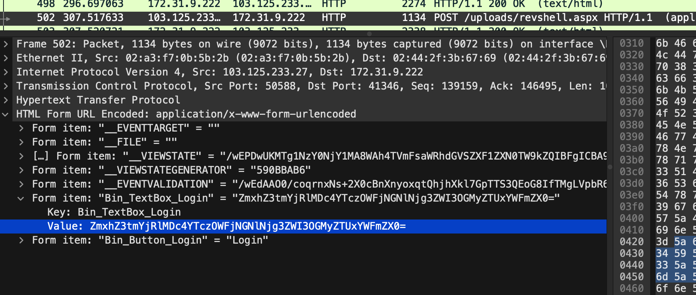
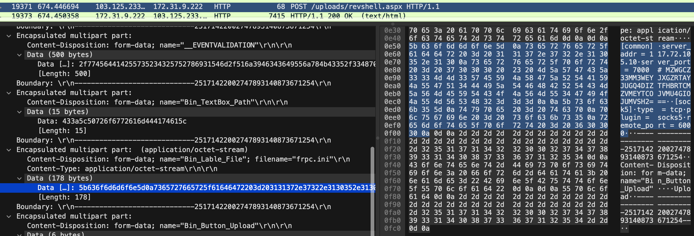

Three files have been given:
* Sysmon.evtx
* Traffic.pcapng
* HTTP.log

Evidences:
* HTTP.log file show reverse-shell upload request POST/GET http queries
* From Traffic.pcapng an upload of a frpc.exe 
* WebShell used `WebShell Ver: ASPXSpy2014`

the first flag can be found inspecting the pcap file. 

by filtering on HTTP POST requests, we can find in frame 502 a strange base64 looking username in for form data 

base64 decode it for the first (third) flag

the `frpc` binary file doesn't seem to be of any use, but looking at the event log, we can see it is paires with a `frpc.ini` config file

if we keep looking at the post requests we see the upload of `frpc.ini` in frame 19371

it reveals the [config file](https://cyberchef.formality.de/#recipe=From_Hex('Auto')&input=NWI2MzZmNmQ2ZDZmNmU1ZDBhNzM2NTcyNzY2NTcyNWY2MTY0NjQ3MjIwM2QyMDMxMzEzNzJlMzczMjJlMzEzMDM1MmUzMTMwMGE3MzY1NzI3NjY1NzI1ZjcwNmY3Mjc0MjAzZDIwMzczMDMwMzAyMDIzMjA0ZDVhNTc0NzQzNWEzMzMzNGQ0ZDMzNTc0NTU5NGE1ODQ3NWE1MjU0NDE1OTRhNTU0NzUxMzQ0NDQ5NWE1NDQ2NDg0MjUyNTQ0MzRkNWE1NjRkNDU1OTU0NDM0ZjRhNTY0ZDU1MzQ0NzQ5NGY0YTU1NGQ1NjUzNDgzMjNkM2QzZDBhMGE1YjczNmY2MzZiMzU1ZDBhNzQ3OTcwNjUyMDNkMjA3NDYzNzAwYTcwNmM3NTY3Njk2ZTIwM2QyMDczNmY2MzZiNzMzNTBhNzI2NTZkNmY3NDY1NWY3MDZmNzI3NDIwM2QyMDM2MzAzMDMwMGE) which contains another base64 looking string as a comment we can [decode for the second flag](https://cyberchef.formality.de/#recipe=From_Base32('A-Z2-7%3D',false)&input=TVpXR0NaMzNNTTNXRVlKWEdaUlRBWUpVR1E0RElaVEZIQlJUQ01aVk1FWVRDT0pWTVU0R0lPSlVNVlNIMj09PQ&oeol=FF)

