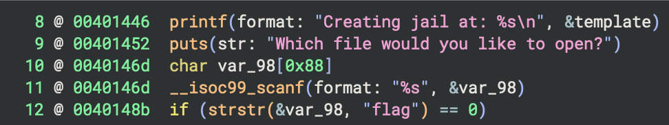
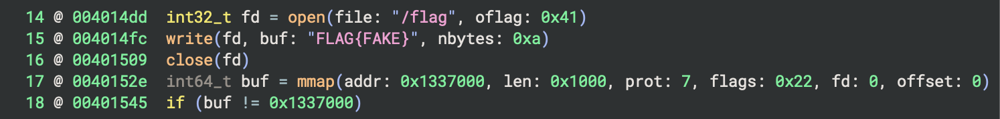
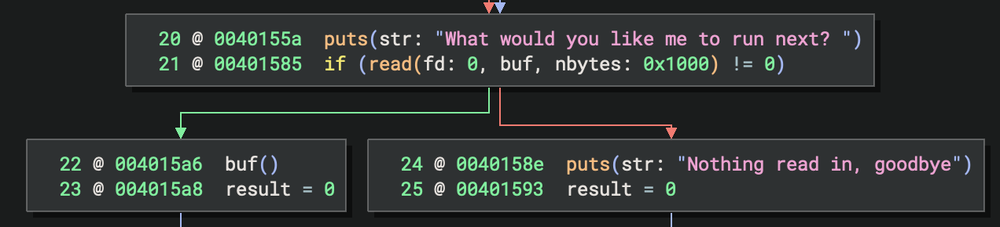

opening up the `trapped` ELF in binary ninja, we can see some interesting things

using `scanf` is notoriously not secure with string input buffers

later on, we can observe that a `flag` file is written in the root of the jail then we initialize a buffer at a very specific memory address `0x1337000`

this buffer is later executed ? 

my guess is we're guided into sending a payload to create a buffer overflow to inject arbitrary data at `0x1337000` 

to be continued